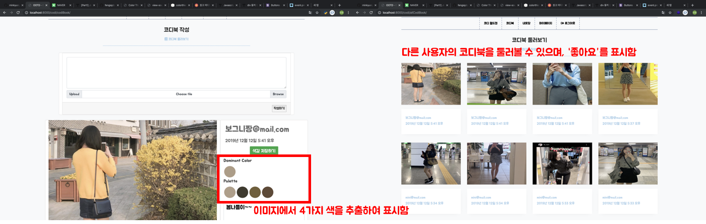

## 날씨 별 코디 추천 OOTD(Outfit Of The Day) 웹 서비스 :dress:

> T4IR 옷입혀조 : 안소현 김지연 조민경

[heroku 배포 사이트 보러가기](https://ootd-365.herokuapp.com/codi/) / [Github branch를 활용한 협업](https://github.com/minkyungcho/OOTD)

- **프로젝트 개요 :**

'오늘의 날씨는 확인했지만', '옷장에 옷은 많지만' 무슨 옷을 입을까 매일 아침 고민하는 사람들을 위해 **오늘의 코디**를 추천하고자 함

① **내 옷장**에 실제 소유하고 있는 옷을 등록할 수 있음

② **날씨 데이터**를 기반으로 내 옷장의 옷 중 '오늘 입을 수 있는' 옷을 선정하여 **코디월드컵**을 진행

③ 오늘 입은 코디를 **코디북**에 업로드하여 기록하고 공유할 수 있으며, 이미지를 대표할 수 있는 **색감 4가지**를 추출하여 특별하게 표시할 수 있음

- **사용하는 기술 :**
  - Language : Python, HTML, CSS, Javascript
  - Framework : Django
  - Library : 공공데이터포털 API (날씨정보), Color Thief API (이미지에서 색 추출)
- **주요 기능 :**

메인

회원가입 및 로그인

> Django에서 제공하는 auth를 사용하여 form으로 구현 (아이디는 이메일 형식, 비밀번호는 영어와 숫자 섞어서 8자리 이상)

내 옷장 추가하기

> Django ORM을 활용하여 내 옷장에 등록한 옷을 확인 가능 / 사용자가 직접 촬영을 해야하는 번거로움을 줄이기 위하여 데이터를 크롤링하여 미리 옷장에 코디 데이터를 구축

코디월드컵

> 공공데이터포털의 동네정보 API에서 날씨 정보를 받아와 내 옷장의 옷을 기반으로 코디를 선정하여 추천 -> 최종 선택된 코디는 마이페이지에 날짜와 함께 기록

코디북

> 오늘 입은 옷 사진과 게시글을 업로드하여 코디북에 기록 -> Color Thief API를 활용하여 게시한 사진의 색감을 추출하여 함께 저장할 수 있으며, '좋아요'와 다른 사용자와 공유 가능